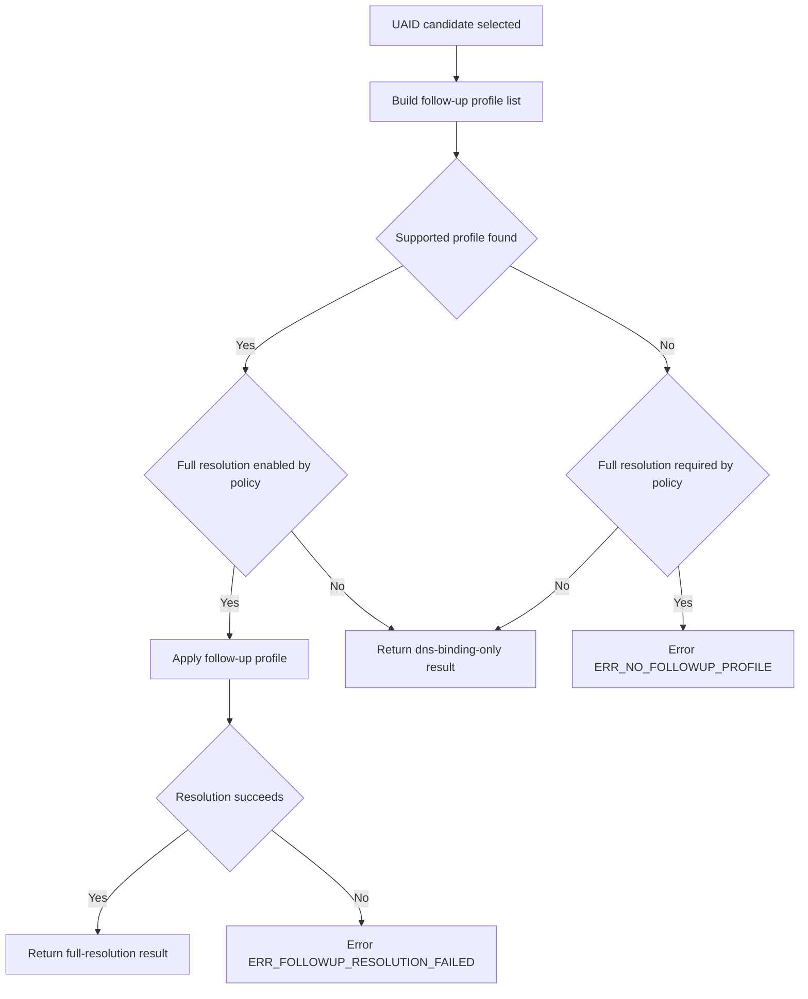
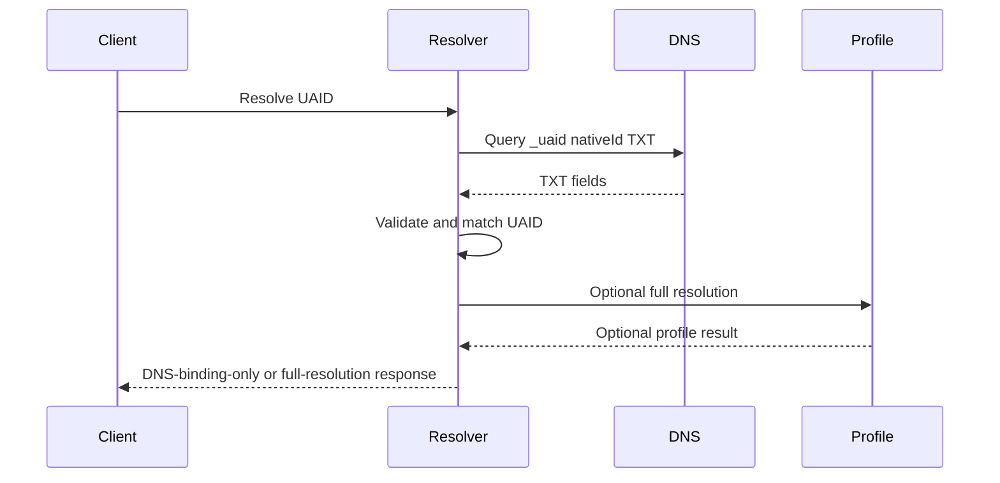

# HCS-14 Profile: UAID Resolution via `_uaid` DNS TXT

**Profile ID:** `hcs-14.profile.uaid-dns-web`
**Status:** Experimental
**Version:** 0.1.0
**Applies to:** `uaid:aid:*` and `uaid:did:*` where `nativeId` is an FQDN

## 1. Scope

This profile defines DNS-based UAID identity binding using a dedicated TXT record at:

```
_uaid.<nativeId>
```

The TXT payload carries HCS-14 identifier components and routing parameters directly, so resolvers can validate that a domain explicitly advertises a specific UAID and optionally continue to a profile that performs full resolution.

This profile:
- defines `_uaid` TXT record structure and validation;
- defines deterministic reconstruction of UAID from TXT fields;
- defines optional continuation to profile-specific full resolution.

This profile is optional. HCS-14 core does not require support for it.

## 2. Terminology and Conformance

The key words **MUST**, **MUST NOT**, **SHOULD**, **SHOULD NOT**, and **MAY** are to be interpreted as described in RFC 2119.

A resolver is conformant with this profile if it implements all normative requirements in Sections 3–10.

## 3. Applicability (Normative)

This profile applies when all conditions are met:

1. Input is a valid `uaid:aid:*` or `uaid:did:*`.
2. UAID `nativeId` is present and is a valid FQDN.
3. Resolver is configured to support this profile.

If any condition fails, resolver MUST NOT apply this profile.

## 4. Discovery via `_uaid` TXT (Normative)

### 4.1 DNS record name

Resolvers implementing this profile MUST query:

```
_uaid.<nativeId>
```

Example:

```
_uaid.support-agent.example.com
```

### 4.2 TXT record format

Resolvers MUST parse TXT payload as semicolon-delimited key-value fields.

Required keys:

| Key | Required | Meaning |
|---|---:|---|
| `target` | yes | HCS-14 target; MUST be `aid` or `did`. |
| `id` | yes | HCS-14 identifier component (the part after `uaid:{target}:`). |
| `uid` | yes | HCS-14 `uid` parameter value. |
| `proto` | yes | HCS-14 `proto` parameter value. |
| `nativeId` | yes | HCS-14 `nativeId` parameter value. |

Optional keys:

| Key | Meaning |
|---|---|
| `registry` | HCS-14 `registry` parameter value, if used by the UAID. For self-sovereign identifiers without a registry namespace, this key MAY be omitted. |
| `domain` | HCS-14 `domain` parameter value, if used by the UAID. |
| `src` | HCS-14 `src` parameter value for `uaid:did:*` sanitized IDs, used to recover the full base DID for DID resolution and key discovery. |
| `did` | Full DID string for `uaid:did:*` records. If present, resolvers MAY use it as a direct DID-resolution input for key discovery. |
| `m` | Optional short memo for operators/indexers. MUST NOT affect UAID reconstruction or matching. |

Unknown keys MUST be ignored for forward compatibility.

This profile defines no profile-local TXT version field. Compatibility is governed by profile ID and specification version.

This profile intentionally does not define TXT fields that directly carry public-key material. For `uaid:did:*`, verifiers SHOULD obtain key material through DID resolution (using `did` directly when present, or deriving from UAID/`src` otherwise).

### 4.3 Field validation

Resolvers MUST validate:

1. `target` is exactly `aid` or `did`.
2. `id` is non-empty.
3. `uid`, `proto`, and `nativeId` are non-empty.
4. `nativeId` equals the queried `<nativeId>` (case-insensitive DNS comparison).
5. If `registry` is present, it MUST be non-empty.
6. If `did` is present, `target` MUST be `did` and `did` MUST start with `did:`.

Records failing validation MUST be rejected.

## 5. UAID Reconstruction and Binding (Normative)

For each valid TXT candidate, resolver MUST reconstruct candidate UAID using HCS-14 parameter order:

```
uaid:{target}:{id};uid={uid}[;registry={registry}];proto={proto};nativeId={nativeId}[;domain={domain}][;src={src}]
```

The `did` and `m` keys, when present, MUST NOT be included in reconstructed UAID.

Resolver MUST then compare reconstructed candidate against input UAID after applying HCS-14 canonical ordering rules.

A candidate is accepted only if:
- `target` and `id` match input UAID target/id, and
- reconstructed UAID equals input UAID under canonical parameter ordering.

If no candidates are accepted, resolver MUST fail with `ERR_UAID_MISMATCH`.

If multiple candidates are accepted, resolver MUST select deterministically by lexicographically smallest reconstructed UAID string.

## 6. Optional Full Resolution (Normative)

For selected candidate:

1. Resolver SHOULD use a deterministic local profile-selection policy based on UAID parameters (for example, `target`, `proto`, and optional `registry`).
2. Resolver SHOULD select the first supported follow-up profile under that policy.
3. If a supported follow-up profile is available, resolver MAY apply it.
4. If no supported follow-up profile is available, resolver MAY return a DNS-binding-only success result from this profile.
5. If resolver policy requires full resolution and no supported follow-up profile is available, resolver MUST fail with `ERR_NO_FOLLOWUP_PROFILE`.
6. If follow-up resolution is attempted and fails, resolver MUST fail with `ERR_FOLLOWUP_RESOLUTION_FAILED`.



This profile does not define endpoint extraction. Endpoint resolution and protocol-specific verification are performed by follow-up profiles.

### 6.1 Deterministic follow-up selection example (Informative)

Resolvers can use this deterministic flow:

1. Build candidate follow-up profiles in configured precedence order.
2. Filter candidates by applicability predicates that depend on UAID parameters (for example, `target`, `proto`, and optional `registry`).
3. Select the first supported profile in the filtered list.
4. If no profile remains, return DNS-binding-only success unless local policy requires full resolution.

## 7. Verification Levels (Normative)

Resolvers SHOULD support both levels below.

### 7.1 Level 1: DNS UAID Binding Verification (Required)

Resolver MUST:
1. Validate `_uaid` record fields (Section 4.3).
2. Reconstruct and match UAID (Section 5).

### 7.2 Level 2: DNSSEC-Assisted Binding (Optional)

Resolver MAY elevate assurance when DNSSEC validation is successful for `_uaid` response.

If resolver claims Level 2 under this profile, Level 1 MUST pass and DNSSEC validation result MUST be positive.

## 8. Resolver Output Requirements (Normative)

For successful resolution, resolver MUST report:
- selected profile (`hcs-14.profile.uaid-dns-web`);
- verification level (`dns-binding` or `dns-binding-dnssec`);
- reconstructed UAID;
- selected follow-up profile (if any);
- resolution mode (`dns-binding-only` or `full-resolution`).

If follow-up resolution is performed, resolver SHOULD include follow-up result metadata.

## 9. Error Handling (Normative)

Resolvers MUST return structured errors on failure.

Required error codes:

* `ERR_NOT_APPLICABLE` — profile conditions not met.
* `ERR_NO_DNS_RECORD` — `_uaid` record missing.
* `ERR_INVALID_UAID_DNS_RECORD` — TXT payload malformed/invalid.
* `ERR_UAID_MISMATCH` — TXT UAID fields do not match input UAID.
* `ERR_NO_FOLLOWUP_PROFILE` — resolver policy requires full resolution, but no supported follow-up profile is available.
* `ERR_FOLLOWUP_RESOLUTION_FAILED` — follow-up resolution was attempted and failed.

## 10. Security Considerations

* DNS responses SHOULD be DNSSEC-validated where available.
* Strict UAID reconstruction and equality checks prevent silent parameter drift.
* Follow-up profile selection policy SHOULD be deterministic and auditable.
* This profile alone does not prove endpoint control; endpoint integrity depends on follow-up profile behavior.

## 11. Examples (Informative)

### 11.1 Example TXT record

```
_uaid.support-agent.example.com TXT "target=aid; id=7Xt9kPmVnBwQ2rY...; uid=support-agent-v1; registry=example-registry; proto=a2a; nativeId=support-agent.example.com; domain=example.com"
```

### 11.2 Example reconstructed UAID

```
uaid:aid:7Xt9kPmVnBwQ2rY...;uid=support-agent-v1;registry=example-registry;proto=a2a;nativeId=support-agent.example.com;domain=example.com
```

### 11.3 Example resolution flow


