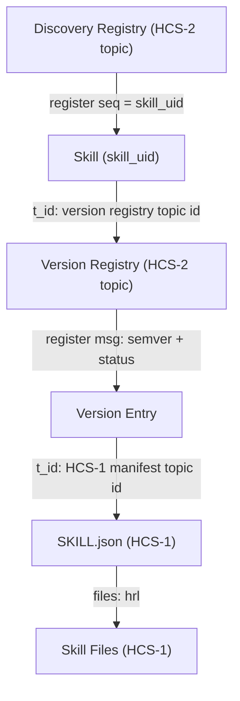
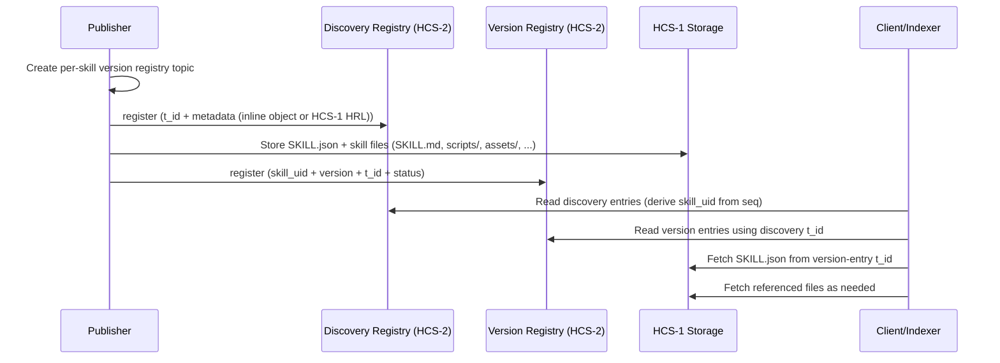

# HCS-26 Standard: Decentralized Agent Skills Registry

### Status: Draft
### Version: 1.1
### Table of Contents
- [Authors](#authors)
- [Abstract](#abstract)
- [Motivation](#motivation)
- [Normative Language](#normative-language)
- [Specification](#specification)
- [Rationale](#rationale)
- [Backwards Compatibility](#backwards-compatibility)
- [Security Considerations](#security-considerations)
- [Privacy Considerations](#privacy-considerations)
- [Test Vectors](#test-vectors)
- [Conformance](#conformance)
- [References](#references)
- [Governance Record (fill at publication)](#governance-record-fill-at-publication)
- [License](#license)

## Authors
- Jake Hall (https://x.com/jaycoolh)

## Co-Authors
- Michael Kantor (https://x.com/kantorcodes)

## Abstract

HCS-26 defines a decentralized registry for Agent Skills using HCS-2 topic registries with versioning and HCS-1 file storage. Each skill is identified by the sequence number of its discovery registration message. Skill versions reference a manifest stored on HCS-1, which maps a logical folder of skill files and optional subdirectories such as `scripts/`, `references/`, and `assets/`.

## Motivation

Agent Skills are increasingly shared across ecosystems and need a verifiable, decentralized way to publish, discover, and version skill packages. Existing standards provide file storage (HCS-1) and registries (HCS-2), but do not define a cohesive workflow for skill publication, version management, and structured skill folders. HCS-26 fills this gap with a minimal, composable design that works with existing HCS infrastructure.

## Normative Language

The key words “MUST”, “MUST NOT”, “SHOULD”, “SHOULD NOT”, and “MAY” are to be interpreted as described in RFC 2119 and RFC 8174.

## Specification

### Architecture Overview

HCS-26 uses two HCS-2 registries:

- **Skill Discovery Registry**: a global, indexed HCS-2 topic that records skills. The sequence number of the `register` message becomes the skill identifier (`skill_uid`).
- **Skill Version Registry**: an indexed HCS-2 topic per skill, listing versions and pointing to the HCS-1 manifest (`SKILL.json`).

A skill is a logical folder described by a manifest and a set of HCS-1 files. The manifest maps file paths to HCS-1 HRLs and includes metadata.





### Terminology

- **Skill UID**: the sequence number of the discovery registry `register` message.
- **Discovery Registry**: the HCS-2 registry topic where skills are registered.
- **Version Registry**: the HCS-2 registry topic that lists versions of a single skill.
- **Manifest**: the `SKILL.json` file stored on HCS-1 describing the skill folder.
- **HRL**: Hashgraph Resource Locator `hcs://{protocol}/{topic_id}`.

Implementations MUST treat a skill as the tuple `(discovery_registry_topic_id, skill_uid)` to ensure global uniqueness.

### Topic Types and Memo Format

HCS-26 uses the HCS-2 memo convention with the following format:

```
hcs-26:{indexed}:{ttl}:{type}
```

**Type Enum Values**

| Type Enum | Topic Type             | Description                            |
| --------- | ---------------------- | -------------------------------------- |
| `0`       | Skill Discovery        | Global discovery registry (indexed)    |
| `1`       | Skill Version Registry | Per-skill version registry (indexed)   |
| `2`       | Reputation Topic       | Optional reputation registry (indexed) |

**Recommended memos**

- Discovery registry: `hcs-26:0:86400:0`
- Version registry: `hcs-26:0:86400:1`
- Reputation topic: `hcs-26:0:86400:2`

### Transaction Memo Format (Analytics)

Every HCS-26 operation SHOULD include a transaction memo for analytics:

```
hcs-26:op:<operationEnum>:<topicTypeEnum>
```

| Operation  | Enum |
| ---------- | ---- |
| `register` | `0`  |
| `update`   | `1`  |
| `delete`   | `2`  |
| `migrate`  | `3`  |

| Topic Type  | Enum |
| ----------- | ---- |
| discovery   | `0`  |
| version     | `1`  |
| reputation  | `2`  |

### Discovery Registry Operations

Discovery registry messages extend HCS-2 and use `p: "hcs-26"`.

#### Register (Skill Creation)

The `register` operation records a new skill in the discovery registry. The sequence number of the `register` message becomes the **Skill UID**.

Because some ecosystems enforce small message-size budgets for registry entries, HCS-26 supports `metadata` as either an inline object or an HCS-1 HRL string pointing to a metadata JSON document stored on HCS-1.

```json
{
  "p": "hcs-26",
  "op": "register",
  "t_id": "0.0.123456",
  "account_id": "0.0.78910",
  "metadata": {
    "name": "PDF Processing",
    "description": "Extract and clean PDF text",
    "author": "Example Labs",
    "license": "Apache-2.0",
    "tags": [60101, 60201, 90101],
    "languages": ["python"],
    "homepage": "https://example.com/skills/pdf-processing",
    "repo": "https://github.com/example-labs/pdf-processing-skill",
    "commit": "9fceb02e5f0f1a0b7b6c1b2d3e4f5a6b7c8d9e0f"
  },
  "m": "optional memo"
}
```

Example with metadata stored via HCS-1:

```json
{
  "p": "hcs-26",
  "op": "register",
  "t_id": "0.0.123456",
  "account_id": "0.0.78910",
  "metadata": "hcs://1/0.0.22222",
  "m": "metadata stored on HCS-1"
}
```

| Field        | Type              | Required | Description                                                             |
| ------------ | ----------------- | -------- | ----------------------------------------------------------------------- |
| `p`          | string            | Yes      | Protocol identifier (`hcs-26`).                                         |
| `op`         | string            | Yes      | `register`.                                                             |
| `t_id`       | string            | Yes      | Topic ID for the per-skill version registry.                            |
| `account_id` | string            | Yes      | Hedera account ID of the publisher.                                     |
| `metadata`   | object \| string  | Yes      | Skill metadata object (schema below) or HCS-1 HRL to a metadata JSON.    |
| `m`          | string            | No       | Optional memo (max 500 characters).                                     |

**Rules**

- `metadata` MUST be either a metadata object or an HCS-1 HRL string.
- If `metadata` is an HCS-1 HRL string, clients MUST resolve it via HCS-1 and treat the resolved JSON as the metadata object.

#### Update

```json
{
  "p": "hcs-26",
  "op": "update",
  "uid": "42",
  "account_id": "0.0.78910",
  "metadata": {
    "description": "Extract and clean PDF text (includes OCR)",
    "tags": [1403, 60101, 60201, 90101]
  },
  "m": "update description and tags"
}
```

| Field           | Type   | Required | Description                                       |
| --------------- | ------ | -------- | ------------------------------------------------- |
| `uid`           | string | Yes      | Sequence number of the original register message. |
| `metadata`      | object \| string | No       | Updated metadata object (partial allowed) or HCS-1 HRL to metadata JSON. |
| `account_id`    | string | No       | Updated publisher account ID.                     |
| `m`             | string | No       | Optional memo (max 500 characters).               |

#### Delete

```json
{
  "p": "hcs-26",
  "op": "delete",
  "uid": "42",
  "m": "remove skill"
}
```

| Field | Type   | Required | Description                                       |
| ----- | ------ | -------- | ------------------------------------------------- |
| `uid` | string | Yes      | Sequence number of the original register message. |
| `m`   | string | No       | Optional memo (max 500 characters).               |

### Version Registry Operations

Version registry messages extend HCS-2 and use `p: "hcs-26"`.

#### Register (New Version)

```json
{
  "p": "hcs-26",
  "op": "register",
  "skill_uid": 42,
  "version": "1.0.0",
  "t_id": "0.0.33333",
  "checksum": "sha256:...",
  "status": "active",
  "m": "initial release"
}
```

| Field       | Type   | Required | Description                                                            |
| ----------- | ------ | -------- | ---------------------------------------------------------------------- |
| `skill_uid` | number | Yes      | Sequence number of the discovery registry register message.            |
| `version`   | string | Yes      | Semantic version string.                                               |
| `t_id`      | string | Yes      | Topic ID of the HCS-1 topic containing the `SKILL.json` manifest file. |
| `checksum`  | string | No       | Hash of the manifest file (recommended).                               |
| `status`    | string | No       | `active`, `deprecated`, or `yanked` (default `active`).                |
| `m`         | string | No       | Optional memo (max 500 characters).                                    |

#### Update

```json
{
  "p": "hcs-26",
  "op": "update",
  "uid": "7",
  "status": "deprecated",
  "m": "superseded by 1.1.0"
}
```

| Field    | Type   | Required | Description                                      |
| -------- | ------ | -------- | ------------------------------------------------ |
| `uid`    | string | Yes      | Sequence number of the version register message. |
| `status` | string | No       | Updated status.                                  |
| `m`      | string | No       | Optional memo (max 500 characters).              |

#### Delete

```json
{
  "p": "hcs-26",
  "op": "delete",
  "uid": "7",
  "m": "remove version"
}
```

### Tags (OASF Skill IDs)

To minimize bytes and align with existing agent ecosystems, tags are represented as numeric OASF skill identifiers (Open Agentic Schema Framework).

- `tags` values MUST be valid OASF skill IDs.
- Publishers SHOULD sort `tags` numerically in ascending order.
- Clients MUST ignore unknown tag values.

OASF taxonomy sources:

- https://github.com/agntcy/oasf
- https://schema.oasf.outshift.com/skill_categories

**OASF Tag Categories (Informative)**

| OASF Category                 | ID Range     | Example Skills                                            |
| ---------------------------- | ------------ | --------------------------------------------------------- |
| Natural Language Processing  | 100-199      | 10102 (Text Generation), 10103 (Entity Recognition)       |
| Images/Computer Vision       | 200-299      | 20101 (Object Detection), 20201 (Image Generation)        |
| Audio                        | 300-399      | 30101 (Speech Recognition), 30201 (Audio Generation)      |
| Tabular/Text                 | 400-499      | 40101 (Text Classification), 40201 (Table QA)             |
| Analytical Skills            | 500-599      | 50301 (Code Generation), 50401 (Mathematical Reasoning)   |
| Retrieval Augmented Generation | 600-699    | 60101 (Information Retrieval), 60201 (Document QA)        |
| Multi-modal                  | 700-799      | 70101 (Image-to-Text), 70201 (Text-to-Image)              |
| Security & Privacy           | 800-899      | 80101 (Threat Detection), 80201 (Privacy Protection)      |
| Data Engineering             | 900-999      | 90101 (Data Cleaning), 90201 (Feature Engineering)        |
| Agent Orchestration          | 1000-1099    | 1001 (Multi-Agent Coordination), 1002 (Task Delegation)   |
| Evaluation & Monitoring      | 1100-1199    | 1101 (Performance Evaluation), 1102 (Quality Assessment)  |
| DevOps/MLOps                 | 1200-1299    | 1201 (Model Deployment), 1202 (Infrastructure Management) |
| Governance & Compliance      | 1300-1399    | 1301 (Policy Enforcement), 1302 (Audit Trail)             |
| Tool Interaction             | 1400-1499    | 1403 (API Integration), 1401 (External Tool Use)          |
| Advanced Reasoning & Planning | 1500-1599   | 1501 (Strategic Planning), 1502 (Complex Reasoning)        |

### Metadata Schema (Discovery Registry)

The discovery registry metadata MUST follow this schema whether provided inline in `metadata` or stored via HCS-1 and referenced by `metadata` as an HCS-1 HRL string.

**Required**

- `name` (string)
- `description` (string)
- `author` (string or `{ name, contact, url }`)
- `license` (string, SPDX ID or `proprietary`)

**Optional**

- `tags` (number[]) (OASF skill IDs)
- `homepage` (string, URL)
- `icon_hcs1` (string, HRL)
- `languages` (string[])
- `capabilities` (string[])
- `repo` (string, URL)
- `commit` (string, git commit SHA)

### Skill Manifest: `SKILL.json`

Each skill version MUST reference a `SKILL.json` manifest stored on HCS-1. The manifest defines the skill folder and file mappings.

**Required fields**

- `name` (string)
- `description` (string)
- `version` (string, semver)
- `license` (string, SPDX ID or `proprietary`)
- `author` (string or object)
- `files` (array of file entries)
- `files` MUST include an entry for `SKILL.md` at the root (`path` = `SKILL.md`).

**Optional fields**

- `tags` (number[]) (OASF skill IDs)
- `homepage` (string, URL)
- `languages` (string[])
- `repo` (string, URL)
- `commit` (string, git commit SHA)
- `entrypoints` (array of runnable scripts)

**File entry schema**

- `path` (string, relative path)
- `hrl` (string, HCS-1 HRL)
- `sha256` (string, hex)
- `mime` (string)

**Example manifest**

```json
{
  "name": "PDF Processing",
  "description": "Extract and clean PDF text",
  "version": "1.0.0",
  "license": "Apache-2.0",
  "author": "Example Labs",
  "tags": [60101, 60201],
  "languages": ["python"],
  "repo": "https://github.com/example-labs/pdf-processing-skill",
  "commit": "9fceb02e5f0f1a0b7b6c1b2d3e4f5a6b7c8d9e0f",
  "entrypoints": [
    { "path": "scripts/extract.py", "language": "python", "args": ["--fast"] }
  ],
  "files": [
    {
      "path": "SKILL.md",
      "hrl": "hcs://1/0.0.44444",
      "sha256": "...",
      "mime": "text/markdown"
    },
    {
      "path": "scripts/extract.py",
      "hrl": "hcs://1/0.0.55555",
      "sha256": "...",
      "mime": "text/x-python"
    },
    {
      "path": "references/REFERENCE.md",
      "hrl": "hcs://1/0.0.66666",
      "sha256": "...",
      "mime": "text/markdown"
    }
  ]
}
```

### Skill Folder Conventions

Skills are logical folders represented by `files[].path` entries. Paths MUST be normalized and MUST NOT contain `..`.

Optional directories:

- `scripts/` for executable code
- `references/` for additional documentation and forms
- `assets/` for static resources

The file `SKILL.md` MUST be included at the root to describe the skill in Agent Skills format. Its frontmatter `name`, `description`, and `version` SHOULD match the manifest values.

### Retrieval Rules

1. Discover skills from the discovery registry topic.
2. The skill identifier is the sequence number of the discovery `register` message.
3. If `metadata` is an HCS-1 HRL string, fetch metadata JSON via HCS-1; otherwise use inline metadata object.
4. Fetch the per-skill version registry using the discovery entry `t_id` (version registry topic id).
5. Select the highest semantic version with `status = active`.
6. Retrieve `SKILL.json` via HCS-1 from the version entry `t_id` and load any referenced files as needed.

### Reputation Architectures (Informative)

Implementations MAY adopt one of the following reputation architectures. Each uses an HCS-2 indexed topic with type enum `2`.

#### Option A: Signed Usage Receipts

- **Schema**: `skill_uid`, `version`, `rater_id`, `agent_id`, `score`, `receipt_hash`, `sig`
- **Reliability**: requires cryptographic signatures and replay protection; indexers SHOULD enforce minimum receipt counts.

#### Option B: Stake-Backed Attestations with Dispute

- **Schema**: `skill_uid`, `version`, `claim`, `score`, `stake_ref`
- **Reliability**: rater posts a bond; disputes resolved via HCS-8 poll; losing side is slashed.

#### Option C: Multi-Indexer Reputation Consensus

- **Schema**: `skill_uid`, `version`, `score`, `indexer_id`, `sig`, `snapshot_hash`
- **Reliability**: clients require >= N of M matching signed snapshots.

### Validation Rules

- `p` MUST equal `hcs-26`.
- `op` MUST be one of `register`, `update`, `delete`, `migrate`.
- Discovery `register` MUST include `t_id` and `account_id`.
- Discovery `register` MUST include `metadata`.
- Discovery `register.t_id` MUST be a valid HCS topic ID (the per-skill version registry topic id).
- If `metadata` is a string, it MUST be a valid HCS-1 HRL.
- Version registry `register.t_id` MUST be a valid HCS topic ID for an HCS-1 manifest (`SKILL.json`).
- `skill_uid` MUST be a valid sequence number from the discovery registry topic.
- `version` MUST be a valid semantic version.
- `SKILL.json` MUST be valid JSON and include all required fields.
- `SKILL.md` MUST be present in the manifest `files` list with `path` set to `SKILL.md`.

## Rationale

HCS-26 minimizes new infrastructure by combining HCS-2 registries with HCS-1 file storage and a manifest for folder structure. Using the discovery registry sequence number as the skill identifier eliminates external ID allocation while preserving determinism within a registry.

## Backwards Compatibility

HCS-26 is additive and does not modify existing HCS standards.

## Security Considerations

- Clients SHOULD verify manifest and file hashes before execution.
- Scripts SHOULD be executed in sandboxed environments.
- Discovery registry operators SHOULD monitor for malicious content and rely on `yanked` or `delete` updates.

## Privacy Considerations

Skill manifests and files are public once written to HCS. Publishers SHOULD avoid embedding sensitive data in skills or metadata.

## Test Vectors

See examples in the Discovery and Version Registry sections. Implementations SHOULD validate:

- Skill UID derivation from discovery register sequence number.
- Manifest hash verification and path normalization.
- Status transitions and version selection logic.
- Metadata resolution via inline `metadata` object or via `metadata` as an HCS-1 HRL string.

## Conformance

A conforming HCS-26 publisher MUST:

- Register skills in a discovery registry.
- Publish a per-skill version registry.
- Store `SKILL.json` and all referenced files on HCS-1.

A conforming HCS-26 client MUST:

- Resolve skill UIDs via discovery registry sequence numbers.
- Retrieve and validate the manifest.
- Respect `status` and version selection rules.

## References

- [HCS-1: File Management](./hcs-1.md)
- [HCS-2: Topic Registries](./hcs-2.md)
- [Agent Skills](https://agentskills.io)

## Governance Record (fill at publication)

- Poll topic: hcs://8/<topicId> (or Mirror Node link)
- Outcome: PASS | FAIL on YYYY-MM-DD (UTC)
- Reference: <txn id or final tally link>

## License

This document is licensed under Apache-2.0.
