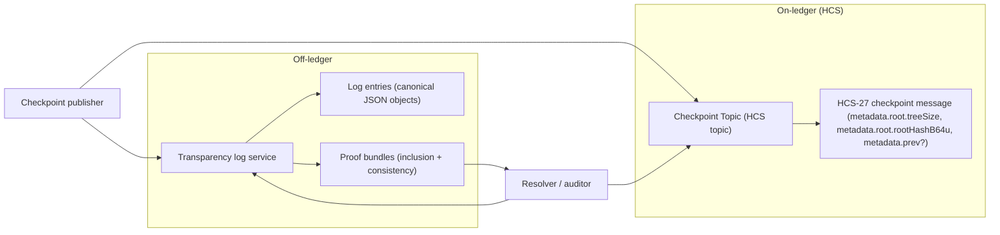
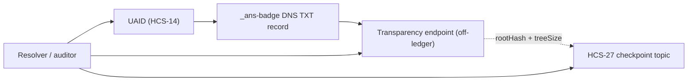

# HCS-27 Standard: ANS Transparency Log Checkpoints

### Status: Draft

### Version: 1.0

## Authors

- Connor Snitker ([csnitker@godaddy.com](mailto:csnitker@godaddy.com))

## Abstract

This standard defines a protocol for anchoring an append-only ANS transparency log to Hedera Consensus Service (HCS) by publishing Merkle tree root checkpoints as typed consensus messages using the HCS-27 base message structure (`p`, `op`, and `metadata`), aligned with HCS-2 field conventions. The on-ledger messages commit to log state via checkpoint metadata (`root` and `prev`) while log entries and cryptographic proofs remain off-ledger.

This standard is designed to interoperate with:

- [HCS-2](http:///docs/standards/hcs-2) registries and attestations (as a compatible registry class), and
- [HCS-14](http:///docs/standards/hcs-14) UAIDs and profiles (for discovery of transparency verification via DNS badge records), without redefining their resolution logic.

## Motivation

Registry operators and auditors need a deterministic, append-only transparency primitive that:

- provides a stable, consensus-ordered commitment stream for registry state over time;
- enables proof of existence (inclusion) for specific registry statements;
- enables verification that checkpoints remain consistent as the log grows (append-only consistency); and
- keeps the ledger footprint small by storing commitments only (not full log entries or proofs).

## Normative Language

The key words "MUST", "MUST NOT", "SHOULD", "SHOULD NOT", and "MAY" are to be interpreted as described in RFC 2119 and RFC 8174.

## Terminology

| Term | Definition |
| :---- | :---- |
| **ANS** | A generic registry class whose records and attestations are represented as an append-only transparency log. |
| **Transparency Log** | An append-only sequence of entries whose append-only property is verified via consistency proofs between successive Merkle roots. |
| **Checkpoint** | A published commitment to the current transparency log state, consisting of `(tree_size, root_hash)` plus optional linkage to the previous checkpoint. |
| **Tree Size** | Unsigned integer count of entries committed by the checkpoint (`metadata.root.treeSize`). |
| **Leaf** | The hashed representation of a single log entry in the Merkle tree. |
| **Leaf Index** | The 0-based position of a log entry within a given `(registry, log_id)` stream. |
| **Inclusion Proof** | A cryptographic proof that an entry is included in the tree committed by a checkpoint. |
| **Consistency Proof** | A cryptographic proof that a later checkpoint is an append-only extension of an earlier checkpoint. |
| **Checkpoint Topic** | An HCS topic carrying HCS-27 checkpoint register messages (`p: "hcs-27"`, `op: "register"`). |
| **Checkpoint Cadence** | Publisher-defined interval for publishing new checkpoints (for example, every 5 minutes). |

## Specification

### Scope and Non-Goals

This standard defines:

- one on-ledger checkpoint message type (`register` envelope carrying checkpoint metadata);
- one topic type (`checkpoint`) for ordered root commitments;
- validation rules for checkpoint envelope, field formats, and checkpoint chaining;
- a deterministic overflow contract for messages larger than 1 KB using HCS-1 HRLs; and
- a deterministic Merkle tree profile required to verify inclusion and consistency proofs.

This standard does not define:

- ANS registry business semantics (for example, naming, dispute, and issuance policy);
- log entry schemas or registry event structures;
- how registry statements are authored, hosted, or moderated;
- how publishers distribute trust anchors and key governance metadata;
- off-ledger API response formats for proof delivery (consuming profiles define their own API contracts); or
- DNS-based discovery mechanisms for transparency endpoints (defined by consuming profiles such as the HCS-14 ANS DNS profile).

### On-ledger vs Off-ledger

**On-ledger (HCS)**:

- HCS-27 register messages where `metadata` is either inline checkpoint metadata or an HCS-1 reference to full checkpoint metadata.

**Off-ledger**:

- log entries, inclusion proofs, and consistency proofs;
- publisher key-discovery material for signed roots; and
- any transport APIs used to fetch proofs and entry bundles.

Auditors MUST treat the checkpoint topic as the source of truth for the ordered root-commitment chain. Off-ledger content MUST NOT be treated as authoritative unless it is cryptographically verifiable against an on-ledger checkpoint.

### Diagrams (Informative)

Checkpoint anchoring overview:



Typical verification flow:

```
sequenceDiagram
  participant P as Publisher
  participant L as Off-ledger log service
  participant H as HCS checkpoint topic
  participant V as Verifier

  P->>L: Append entries (off-ledger)
  L-->>P: tree_size + root_hash (current checkpoint state)
  P->>H: Publish HCS-27 checkpoint (metadata.root.treeSize, metadata.root.rootHashB64u, metadata.prev?)

  V->>H: Read checkpoint stream (ordered)
  V->>L: Request entry + proof bundle
  L-->>V: entry + inclusion proof (+ consistency proof)
  V->>V: Verify proofs against checkpoint(s)
```

### Topic System

#### Checkpoint Topic

Publishers MUST publish HCS-27 checkpoint messages to at least one Checkpoint Topic.

##### Topic Types and Enums (Normative)

| Enum | Name | Description |
| ----: | :---- | :---- |
| 0 | `checkpoint` | Topic containing HCS-27 checkpoint messages |
| 1..255 | reserved | Reserved for future topic types; MUST NOT be used in HCS-27 v1.0 |

HCS-27 defines only the `checkpoint` topic type enum. `checkpoint_topic_id` carries HCS-27 checkpoint messages. Per-agent lifecycle indexing is out of scope for HCS-27 and is defined by HCS-28.

##### Topic memo (recommended)

```
hcs-27:0:<ttl>:0
```

Where `0` indicates indexed topic behavior, `<ttl>` is cache TTL in seconds, and the final `:0` is the HCS-27 topic enum (`checkpoint`).

##### Topic partitioning (recommended)

For scalability, publishers SHOULD use a dedicated Checkpoint Topic per `(registry, log_id)` stream.

Implementations MAY multiplex multiple streams on one Checkpoint Topic; if multiplexed, effective `stream.registry` and `stream.log_id` MUST be used to partition stream state. Multiplexing is NOT RECOMMENDED for high-volume deployments.

Registries SHOULD publish an HCS-2 indexed directory where:

- each `(registry, log_id)` stream maps to `checkpoint_topic_id`.

For large ecosystems, registries MAY use hierarchical directories where a top-level directory maps namespaces to per-registry directories, and each per-registry directory maps `log_id` values to Checkpoint Topic IDs.

Topic hierarchy overview (informative):

```
flowchart TB
  Dir["Directory (HCS-2 indexed)"]
  Reg["Per-registry directory (optional)"]
  Cp["Checkpoint Topic (HCS) (registry, log_id)"]

  Dir --> Reg
  Reg --> Cp
  Cp -. "roots + tree_size" .-> Cp
```

##### Topic granularity (Informative)

In append-only logs, updates are represented as new log entries, not mutation of prior entries.

Proofs are tied to a specific checkpoint `(tree_size, root_hash)` plus entry bytes and position, so historical states are verified by inclusion against the checkpoint current at that time (or a later checkpoint with validated consistency linkage).

Implementations MAY shard across multiple Checkpoint Topics and/or multiple `log_id` partitions for scaling.

Clarifications:

- HCS-27 `log_id` identifies a log stream within a registry and is not a per-entry idempotency identifier.
- Merkle paths are checkpoint-scoped and SHOULD NOT be treated as stable identifiers.

##### Transaction Memo Format (Recommended)

When publishing checkpoint messages, publishers SHOULD include:

```
hcs-27:op:0:0
```

Where the first `0` is operation enum (`register`) and the final `0` is topic type enum (`checkpoint`).

### Publishing Cadence

Publishers MAY publish checkpoints on a fixed cadence (for example, every 5 minutes).

If root state changes between cadence windows, publishers SHOULD publish the new checkpoint at the next scheduled interval and MUST preserve valid `prev` linkage.

### Message Format

All HCS-27 messages MUST be valid UTF-8 JSON.

#### Operation: `register`

HCS-27 defines one operation:

- `register` (enum `0`)

##### Operation Enums (Normative)

| Enum | Operation | Description |
| ----: | :---- | :---- |
| 0 | `register` | Publish an ANS transparency checkpoint metadata record for the topic stream. |

##### HCS-27 Base Message Structure (Normative)

HCS-27 checkpoint messages use `p` and `op` field conventions compatible with HCS-2, while defining HCS-27-specific `metadata` semantics.

Every checkpoint message MUST include:

- `p` (protocol identifier),
- `op` (operation identifier), and
- `metadata` (checkpoint payload object).

```json
{
  "p": "hcs-27",
  "op": "register",
  "metadata": {
    "type": "ans-checkpoint-v1",
    "stream": {
      "registry": "ans",
      "log_id": "default"
    },
    "log": {
      "alg": "sha-256",
      "leaf": "sha256(jcs(event))",
      "merkle": "rfc9162"
    },

    "root": {
      "treeSize": "123456",
      "rootHashB64u": "fTVIY3QJB...xMSLENTx7w"
    },
    "prev": {
      "treeSize": "120000",
      "rootHashB64u": "n19T4X4w...fV4j4qS8D4A"
    },

    "sig": {
      "alg": "EdDSA",
      "kid": "ed25519:example-key-id",
      "b64u": "MEUCIG...."
    }
  },
  "m": "ANS checkpoint 120000→123456"
}
```

##### 1 KB Message Limit and HCS-1 Overflow (Normative)

HCS topic message payloads are limited to 1024 bytes.

Publishers MUST calculate payload size over the exact UTF-8 bytes of the minified JSON message submitted on-chain:

```
sizeBytes = UTF8(JSON.stringify(message)).length
```

The size calculation MUST include all serialized top-level and nested fields (`p`, `op`, `metadata`, `m`, braces, commas, quoting, escaping, and URL/query text).

- If `sizeBytes <= 1024`, publishers MUST submit the inline checkpoint message shape above.
- If `sizeBytes > 1024`, publishers MUST:
  1. publish the full checkpoint JSON as UTF-8 content via HCS-1;
  2. publish an HCS-27 register message where `metadata` is an HCS-1 reference.

Overflow pointer message:

```json
{
  "p": "hcs-27",
  "op": "register",
  "metadata": "hcs://1/0.0.123456",
  "m": "ANS checkpoint 120000→123456"
}
```

When overflow mode is used, verifiers MUST resolve `metadata`, decode the HCS-1 payload as UTF-8 JSON, and validate that resolved payload as the authoritative checkpoint metadata object. The resolved payload MUST contain the full checkpoint metadata content (`type`, `stream`, `log`, `root`, and any optional checkpoint fields).

##### Effective Metadata Resolution (Normative)

Consumers MUST evaluate an **effective checkpoint metadata** object for every message:

- if `metadata` is an object, effective metadata is the on-ledger `metadata` object; and
- if `metadata` is a string, effective metadata is the resolved HCS-1 JSON object referenced by that string.

All inline validation, chain linkage, and proof-relevant checks in this standard apply to effective metadata unless explicitly stated otherwise.

##### Field Definitions (Normative)

| Field | Type | Required | Description |
| :---- | :---- | :---- | :---- |
| `p` | string | Yes | MUST be `"hcs-27"`. |
| `op` | string | Yes | MUST be `"register"`. |
| `metadata` | object or string | Yes | Inline checkpoint metadata object or HCS-1 reference string to full checkpoint metadata. |
| `metadata.type` | string | Yes (effective) | MUST be `"ans-checkpoint-v1"`. |
| `metadata.stream` | object | Yes (effective) | Stream identity object for partitioning and validation. |
| `metadata.stream.registry` | string | Yes (effective) | Registry namespace label. |
| `metadata.stream.log_id` | string | Yes (effective) | Log identifier scoped to `registry`. |
| `metadata.log` | object | Yes (inline) | Hash-profile details for leaf/root construction. |
| `metadata.log.alg` | string | Yes (inline) | MUST be `"sha-256"`. |
| `metadata.log.leaf` | string | Yes (inline) | Leaf preimage declaration (for example, `"sha256(jcs(event))"`). |
| `metadata.log.merkle` | string | Yes (inline) | Merkle profile declaration. MUST be `"rfc9162"` for HCS-27 Merkle v1. |
| `metadata.root` | object | Yes (inline) | Current root commitment values. |
| `metadata.root.treeSize` | string | Yes (inline) | Total committed entries in the tree (base-10 string). MUST parse to a non-negative integer. |
| `metadata.root.rootHashB64u` | string | Yes (inline) | Base64url-encoded root hash bytes. |
| `metadata.prev` | object | Conditional (inline) | Previous checkpoint root linkage. Required after genesis checkpoint in a stream. |
| `metadata.prev.treeSize` | string | Conditional (inline) | Previous checkpoint tree size (base-10 string). |
| `metadata.prev.rootHashB64u` | string | Conditional (inline) | Previous checkpoint root hash (base64url). |
| `metadata.sig` | object | No (inline) | Optional signature object over checkpoint payload. |
| `metadata.sig.alg` | string | Conditional (inline) | Signature algorithm identifier (for example, `ES256`). |
| `metadata.sig.kid` | string | Conditional (inline) | Key identifier for verifier key lookup. |
| `metadata.sig.b64u` | string | Conditional (inline) | Detached signature bytes in base64url form. This is the signature segment of the full compact JWS that appears as `rootSignature` in off-ledger proof objects. See [merkle-tree-profile.md — Signed Tree Head](./merkle-tree-profile.md#signed-tree-head-normative). |
| `metadata_digest` | object | Recommended (overflow) | Digest of resolved HCS-1 payload for integrity pinning. |
| `metadata_digest.alg` | string | Conditional (overflow) | Digest algorithm (`"sha-256"`). |
| `metadata_digest.b64u` | string | Conditional (overflow) | Base64url digest of HCS-1 payload bytes. |
| `m` | string | No | Optional human-readable checkpoint summary. Must be less than 300 characters. |

##### Signed Tree Head (STH) Payload (Recommended)

If `metadata.sig.b64u` is present, verifiers SHOULD validate against the signed tree head. The full STH format and verification procedure are defined in [merkle-tree-profile.md — Signed Tree Head](./merkle-tree-profile.md#signed-tree-head-normative).

The `metadata.sig` fields map to the compact JWS as follows:

- `metadata.sig.alg` → JWS header `alg`
- `metadata.sig.kid` → JWS header `kid`
- `metadata.sig.b64u` → JWS signature segment (third part of compact serialization)

The on-ledger `metadata.sig` captures only the signature component and key reference for compact storage within the 1 KB message limit. The full compact JWS (containing header, payload, and signature) is available off-ledger as `rootSignature` in proof objects.

##### Publisher Identity (Normative)

Consumers MUST bind each checkpoint to the Hedera transaction record (payer + consensus timestamp), not self-declared JSON identity fields.

### Checkpoint Artifact (Optional, Off-ledger)

If `metadata.proofs.base` is present, the referenced location SHOULD expose checkpoint artifact data that includes:

- checkpoint metadata values sufficient to recompute expected roots;
- inclusion proof endpoints for entry-by-index lookup; and
- consistency proof endpoints between prior and current checkpoints.

This standard does not require a specific hosting protocol for proof artifacts.

Operational note (non-normative): log operators MAY publish an HCS-27 checkpoint for every Signed Tree Head (STH) or at lower cadence, as long as `prev` linkage is continuous for the anchored checkpoint stream.

Implementations that provide checkpoint signatures SHOULD expose:

- a method to retrieve current and historical verification keys (`metadata.sig.kid` resolution); and
- signature payload construction rules if they differ from the recommended payload.

### Merkle Tree Profile (Deterministic)

All HCS-27 logs MUST use the HCS-27 Merkle v1 profile defined normatively in [merkle-tree-profile.md](./merkle-tree-profile.md).

### Proof Objects (Off-ledger)

Proof object shapes and verification algorithms are defined normatively in [merkle-tree-profile.md](./merkle-tree-profile.md).

HCS-27 does not define how proof objects are delivered to consumers. Off-ledger APIs, badge endpoints, and other transport mechanisms are defined by consuming profiles and registry implementations. HCS-27 defines only the cryptographic structures that those mechanisms carry.

### Validation Rules

#### Message Validation (Normative)

For each checkpoint message, consumers MUST validate:

1. `p == "hcs-27"` and `op == "register"`.
2. `metadata` MUST be either an object or a string.
3. If `metadata` is a string, it MUST be an HCS-1 reference (`hcs://1/<topic_id>`) and consumers MUST resolve effective metadata per [Effective Metadata Resolution](#effective-metadata-resolution-normative).
4. Effective `type == "ans-checkpoint-v1"`.
5. Effective `stream.registry` and `stream.log_id` are non-empty strings.
6. Effective metadata MUST include `log` and `root`.
7. Effective `log.alg == "sha-256"` and `log.merkle` is a recognized profile identifier.
8. Effective `root.treeSize` is a canonical base-10 string representing a non-negative integer.
9. Effective `root.rootHashB64u` is valid base64url.
10. If effective `prev` is present, `prev.treeSize` and `prev.rootHashB64u` are both present and valid.
11. If effective `sig` is present, `sig.alg`, `sig.kid`, and `sig.b64u` MUST all be present.
12. If `metadata_digest` is present (overflow mode), the resolved HCS-1 payload digest MUST match `metadata_digest`.

Consumers MUST ignore unknown top-level fields.

Integer handling:

- Integer fields (`treeSize` in `root` and `prev`) MUST be base-10 strings representing non-negative integers with no leading zeros (except `"0"` itself).
- Implementations that parse these values for arithmetic MUST use non-negative arithmetic with at least unsigned 64-bit precision.
- Implementations that cannot safely represent 64-bit values in native number types MUST use arbitrary-precision integer types.

#### Checkpoint Chain Validation (Normative)

For each `(effective stream.registry, effective stream.log_id)` stream in consensus order:

- effective `root.treeSize` MUST be monotonically non-decreasing; and
- each non-genesis checkpoint MUST have effective `prev` equal to the latest accepted `(effective root.treeSize, effective root.rootHashB64u)` for that stream.

If any rule fails, the checkpoint MUST be rejected for that stream.

#### Consistency Validation (Normative)

For accepted consecutive checkpoints `C_prev` and `C_new` in the same stream:

- publishers MUST be able to provide a consistency proof between `C_prev` and `C_new`; and
- auditors SHOULD validate that consistency proof before trusting `C_new` as append-only relative to `C_prev`.

Consistency proof verification rules are defined in [merkle-tree-profile.md](./merkle-tree-profile.md).

#### Freshness Validation (Policy-driven)

Auditors MAY enforce a maximum age between accepted checkpoints.

If no new checkpoint arrives within policy window, auditors MAY mark the stream as stale.

### Integration with Existing Standards

#### HCS-2 Compatibility (Normative)

HCS-27 reuses HCS-2 field conventions (`p`, `op`) for interoperability, but defines its own checkpoint payload semantics and does not redefine HCS-2 state transition logic.

ANS registries implemented as HCS-2 topic registries:

- MAY publish registry statements on HCS-2 topics; and
- MAY log those statements by setting entry `payload.uri` to `hcs://` references and `payload.hash` to SHA-256 of referenced statement bytes.

#### HCS-14 Consumption (Normative)

The HCS-14 ANS DNS profile defines an optional transparency verification flow that uses HCS-27 checkpoint data. In this flow:

1. The HCS-14 resolver discovers a transparency endpoint via `_ans-badge.<nativeId>` DNS TXT records (defined by HCS-14).
2. The endpoint returns off-ledger proof data that can be verified using the algorithms in [merkle-tree-profile.md](./merkle-tree-profile.md).
3. For the highest assurance, the resolver may verify that the proof's root hash and tree size match a published HCS-27 checkpoint on-ledger.

HCS-27 does not define the badge endpoint API, its response format, or the DNS discovery mechanism. Those are HCS-14 concerns. HCS-27's role is providing the on-ledger checkpoint stream and the cryptographic verification algorithms that consuming profiles use.

Resolvers implementing HCS-14 MUST NOT require HCS-27 support for baseline UAID resolution; HCS-27 transparency verification is an optional enhancement.

##### HCS-14 linkage overview (Informative)



### Relation to HCS-28 (Informative)

HCS-27 provides checkpoint root commitments and proof-verification hooks.

HCS-28 defines:

- the HCS-2 directory topic of published agents,
- the per-agent HCS-2 change topics (`t_id`), and
- JWT/hash-input publication rules (including HCS-1 overflow payloads).

Implementations that need both transparency checkpoints and agent lifecycle publication semantics SHOULD use HCS-27 and HCS-28 together.

## Rationale

- Keep HCS-27 minimal and stable: on-ledger checkpoint format, Merkle profile, and proof verification.
- Separate root commitment concerns from agent-level publication concerns.
- Allow independent evolution of checkpoint cadence and agent payload schemas.
- Leave off-ledger API design to consuming profiles and registry implementations.

## Security Considerations

- **Equivocation:** Publishers could emit conflicting streams. Auditors SHOULD pin and monitor a canonical checkpoint topic per transparency stream.
- **Replay/topic injection:** Open topics can contain invalid messages. Consumers MUST validate envelope and field constraints.
- **Staleness:** Fixed-cadence publication can hide delayed updates. Auditors SHOULD enforce freshness policy.
- **Proof withholding:** Checkpoint publication without proofs reduces auditability. Policies SHOULD define rejection behavior for missing proofs.
- **Canonicalization mismatches:** Incorrect JCS or hashing implementation breaks proof verification. Implementations MUST follow [merkle-tree-profile.md](./merkle-tree-profile.md) exactly.
- **Entry authenticity:** Multi-producer deployments SHOULD authenticate entry producers (for example, detached signatures and producer key registries).

## Privacy Considerations

Checkpoint streams are public and may reveal:

- activity volume through `metadata.root.treeSize` growth; and
- operational cadence through consensus timestamps.

Publishers SHOULD avoid embedding sensitive data directly in checkpoint messages.

## Test Vectors

Normative Merkle and proof test vectors are defined in [merkle-tree-profile.md](./merkle-tree-profile.md).

## Conformance

An implementation is conformant with HCS-27 if it satisfies all MUST-level requirements in:

- [Topic System](#topic-system),
- [Message Format](#message-format),
- [Merkle Tree Profile (Deterministic)](#merkle-tree-profile-deterministic),
- [Validation Rules](#validation-rules).

Publishers MUST:

- emit valid `register` checkpoint messages;
- preserve valid `metadata.prev` linkage for each checkpoint stream;
- publish checkpoints according to declared policy/cadence;
- provide inclusion and consistency proofs off-ledger on request.

Auditors MUST:

- validate message fields and chain linkage;
- validate inclusion and consistency proofs before asserting inclusion or append-only properties;
- evaluate stream freshness according to local policy.

## References

- [HCS-2](http:///docs/standards/hcs-2) — Topic Registries
- [HCS-4](http:///docs/standards/hcs-4) — HCS Standardization Process
- [HCS-14](http:///docs/standards/hcs-14) — Universal Agent IDs
- [HCS-28](http:///docs/standards/hcs-28) — ANS Agent Transparency Registry
- RFC 2119 — Key words for use in RFCs to Indicate Requirement Levels
- RFC 8174 — Ambiguity of Uppercase vs Lowercase in RFC 2119 Key Words
- RFC 8785 — JSON Canonicalization Scheme
- RFC 9162 — Certificate Transparency Version 2.0

## Governance Record (fill at publication)

- Poll topic: hcs://8/(or Mirror Node link)
- Outcome: PASS | FAIL on YYYY-MM-DD (UTC)
- Reference:

## License

This document is licensed under Apache-2.0.
